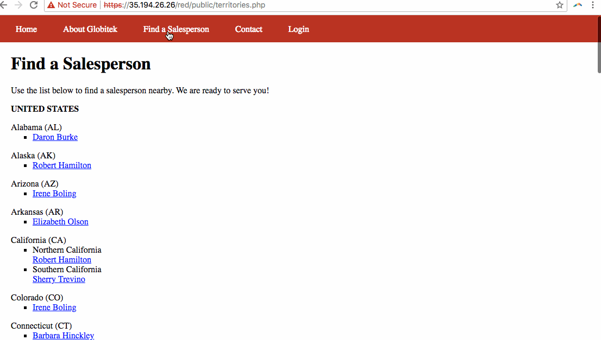
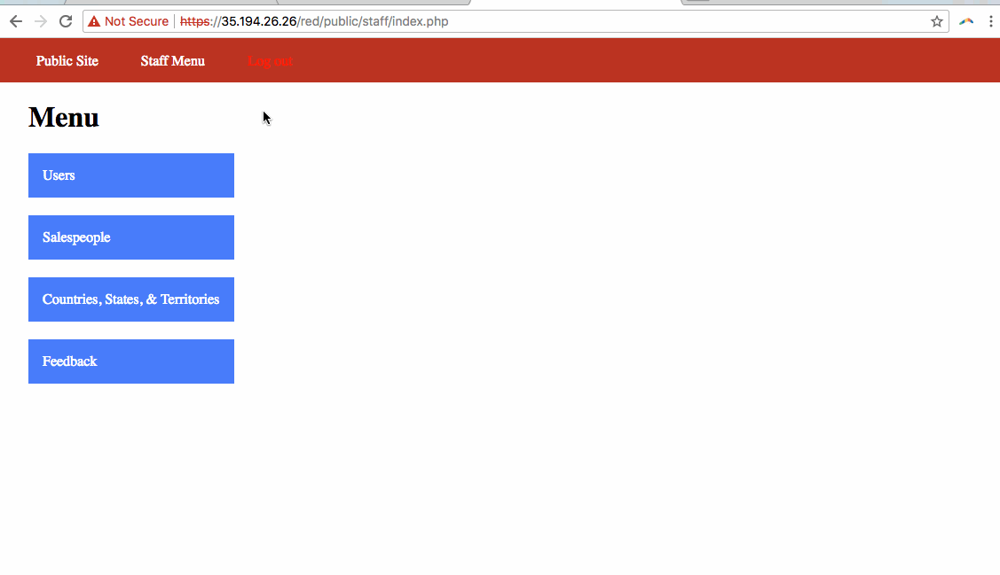
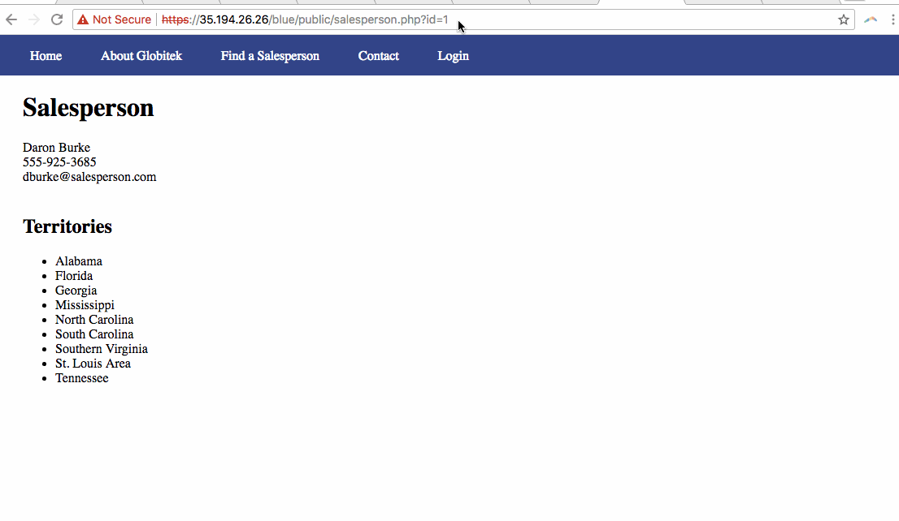
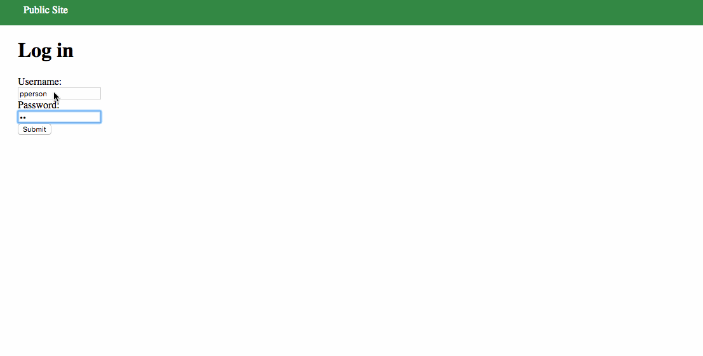

# Week-8
Globitek Exploits

# Project 8 - Pentesting Live Targets

Time spent: **5** hours spent in total

> Objective: Identify vulnerabilities in three different versions of the Globitek website: blue, green, and red.

The six possible exploits are:
* Username Enumeration 
* Insecure Direct Object Reference (IDOR)
* SQL Injection (SQLi)
* Cross-Site Scripting (XSS)
* Cross-Site Request Forgery (CSRF)
* Session Hijacking/Fixation

Each version of the site has been given two of the six vulnerabilities. (In other words, all six of the exploits should be assignable to one of the sites.)

## Blue

Vulnerability #1: SQL Injection → This SQL injection takes place by replacing the id value associated with a salesperson with a ' OR SLEEP(5)=0--'. The Blue page takes 5 seconds to reload while the Green and Red pages are immediate.

Vulnerability #2: Session Hijacking → Open a firefox and chrome browser each with two tabs, one the login page and one with the php session script. Login to chrome with administrator information then transfer the Session ID to Firefox and refresh the page.

## Green

Vulnerability #1: Username Enumeration → The error that the developer made was that the message displayed to the user was bold when using a proper username and not bold once an incorrect username was entered.

Vulnerability #2: Cross-Site Scripting(XSS) → I tried a few alert scripts in the public feedback area. It can be seen when the administrative account looks at the feedback page.

## Red

Vulnerability #1:Insecure Direct Object Reference→ The error that the developer made is that he allowed for a hacker to input another id value at the top of the url, I tested various numbers, the id value 10 worked to show “Testy McTesterson.”

Vulnerability #2:Cross Site Request Forgery → The error that the developer made is that when you input a script in the contact page it shows up in feedback, executes upon click and edits information on target page.

## Notes

No issues to report.

## Gifs
IDOR Gif:

CSRF Gif:

SQLi Gif:

User Enumeration Gif:

Cross Site Scripting Gif:

Hijack Gif:

